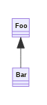

# template-deno-rust-library

> Project template for a Rust library with Deno FFI bindings.

## Usage

1. Use as a
   [template](https://docs.github.com/en/github/creating-cloning-and-archiving-repositories/creating-a-repository-from-a-template)
   to create a new repository.
2. Update links and references in `README.md`.

## Development

Install [deno_bindgen](https://github.com/denoland/deno_bindgen):
`deno install -Afq -n deno_bindgen https://deno.land/x/deno_bindgen/cli.ts`

Build: `deno_bindgen`

Test: `cargo test && deno test -A --unstable`

Lint: `cargo fmt && deno fmt`

## Documentation

### Overview

PNG image generated from `images/uml_diagram.mermaid`:

### API

Link to auto-generated API docs for the library:

[API Documentation](https://docs.rs/crate/flowscripter_template_deno_rust_library/latest)

## License

MIT © Flowscripter
